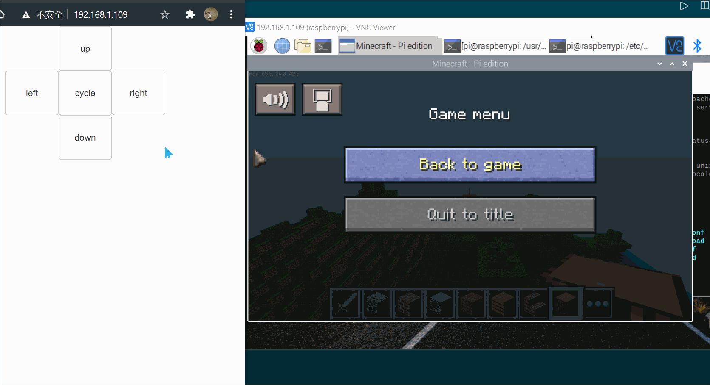

# 浏览器控制树莓派上的我的世界

目录结构:

- cgi-bin
  - handle_arrow.py: 处理前端传来的数据并且控制我的世界
- frontend: 前端页面，使用了bootstrap样式方便布局和jQuery发送ajax请求给python脚本
  - index.html: 主页面html
  - script.js: js文件
  - style.css: 样式文件

演示图:
(也可以用键盘控制浏览器，但这里没有演示)

